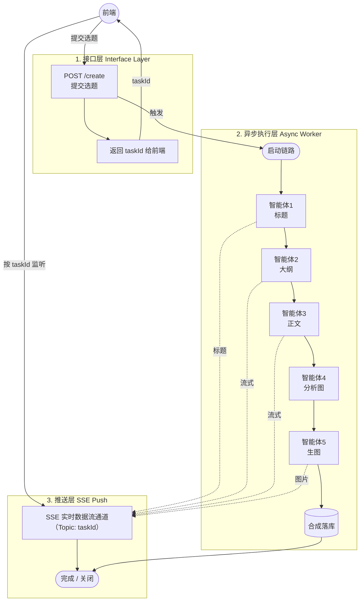

# AI Article Make

面向「AI 写文章」场景的全栈项目：后端提供用户体系与 OpenAPI 文档，前端用 Vue 3 对接同一套接口约定。当前已完成账号注册 / 登录 / 管理能力，文章生成业务尚未接入。

| 模块 | 路径 | 说明 |
|------|------|------|
| 后端 | `src/` | Spring Boot 3 + MyBatis-Flex，默认端口 `8080` |
| 前端 | `fronted/` | Vue 3 + Vite + TypeScript，开发端口由 Vite 分配 |
| 数据库脚本 | `sql/` | 建库建表与变更记录 |

## 技术栈

### 后端

| 技术 | 版本 | 说明 |
|------|------|------|
| Java | 21 | 运行环境 |
| Spring Boot | 3.5.10 | Web / AOP / Redis / Session |
| MyBatis-Flex | 1.11.1 | ORM（`spring-boot3-starter`） |
| MySQL | 8.0+ | 库名 `ai_passage_creator` |
| HikariCP | 4.0.3 | 连接池 |
| Redis | — | 缓存与 Session 存储 |
| Spring Session | — | Session 存 Redis，有效期 30 天 |
| Hutool | 5.8.32 | 工具库 |
| Knife4j | 4.5.0 | 中文 OpenAPI 文档（springdoc） |
| Maven Wrapper | 3.9.9 | 无需本机安装 Maven |

### 前端

| 技术 | 版本 | 说明 |
|------|------|------|
| Vue | 3.5 | UI 框架 |
| Vite | 8 | 构建与开发代理 |
| TypeScript | 6 | 类型检查 |
| Axios | 1.20 | HTTP 客户端（`fronted/src/request.ts`） |

仓库根目录另有 `@umijs/openapi`，用于按 OpenAPI 生成 TypeScript 请求代码（需自行配置 `openapi2ts`）。

## 仓库结构

```
ai-article-make/
├── src/main/java/com/aiarticle/
│   ├── AiArticleMakeApplication.java
│   ├── agent/           # 标题、大纲、正文等串行智能体
│   ├── common/          # BaseResponse、分页 / 删除请求、ResultUtils
│   ├── config/          # 跨域、Knife4j
│   ├── constant/        # 用户角色、文章状态、智能体提示词
│   ├── controller/      # User / Test / Doc
│   ├── exception/       # 业务异常、错误码、全局处理
│   ├── mapper/
│   ├── model/           # dto / entity / state / vo
│   ├── util/            # 大模型调用与 JSON 工具
│   └── service/
│       └── image/       # 可替换的图片检索服务接口
├── src/main/resources/
│   ├── application.yml          # 数据源、Redis、Session、Knife4j
│   └── application.properties   # 端口 8080、日志级别
├── sql/
│   ├── init_user.sql
│   └── CHANGELOG.md
├── fronted/             # Vue 前端（目录名即为仓库实际路径）
└── pom.xml
```

后端分层：

```
controller → service → mapper（MyBatis-Flex BaseMapper）
model/dto 请求  → entity 表映射  → vo 脱敏返回
```

## 环境要求

- JDK 21
- MySQL 8.0+
- Redis（本机默认 `localhost:6379`，无密码）
- Node.js `^22.18.0` 或 `>=24.12.0`（仅跑前端时需要）

## 快速开始

### 1. 初始化数据库

在 MySQL 中执行：

```bash
mysql -u root -p < sql/init_user.sql
```

脚本会创建库 `ai_passage_creator`、表 `user`，并插入测试账号。变更履历见 [`sql/CHANGELOG.md`](sql/CHANGELOG.md)。

预置账号（明文密码均为 `12345678`）：

| 账号 | 角色 |
|------|------|
| `admin` | 管理员 |
| `user` | 普通用户 |
| `test` | 普通用户 |

### 2. 配置后端

MySQL 账号密码写在 `src/main/resources/application.yml`。通义千问与 Pexels Key 使用
`${DASHSCOPE_API_KEY}`、`${PEXELS_API_KEY}` 占位符，取值在
**`config/secrets.properties`**（已 gitignore，不要提交）。填入对应 Key，或通过同名环境变量传入。
Redis 默认本机、无密码。

应用通过实体 `User` / `Article` 使用**雪花 ID**（`KeyType.Generator` + `snowFlakeId`），逻辑删除字段 `isDelete`。表字段为驼峰命名（如 `taskId`、`userAccount`）。实体上必须加 `@Table(camelToUnderline = false)`，否则 MyBatis-Flex 默认把驼峰转成下划线去查库（`taskId` → `task_id`），会报 column 不存在。`application.yml` 里同时关闭了 `map-underscore-to-camel-case`。

### 3. 启动后端

```bash
./mvnw spring-boot:run
# 或
./mvnw clean package -DskipTests
java -jar target/ai-article-make-0.0.1-SNAPSHOT.jar
```

服务地址：`http://localhost:8080`（无 `context-path`）。

### 4. 启动前端

```bash
cd fronted
npm install
npm run dev
```

Vite 把 `/user`、`/api` 代理到 `http://localhost:8080`。浏览器访问 Vite 开发地址即可：登录页 `/login`，注册页 `/register`，登录后进入工作台 `/`。axios 携带 Cookie，与后端 Session 对齐。

## 接口文档

启动后端后：

- Knife4j：http://localhost:8080/doc.html
- 带 `/api` 前缀的入口（重定向到上面）：http://localhost:8080/api/doc.html
- OpenAPI JSON：http://localhost:8080/v3/api-docs/default

## 用户模块

| 说明 | 方法 | 路径 | 权限 |
|------|------|------|------|
| 注册 | POST | `/user/register` | 公开 |
| 登录 | POST | `/user/login` | 公开 |
| 当前用户 | GET | `/user/get/login` | 登录 |
| 注销 | POST | `/user/logout` | 登录 |
| 创建用户 | POST | `/user/add` | 管理员 |
| 删除用户 | POST | `/user/delete` | 管理员（逻辑删除） |
| 更新用户 | POST | `/user/update` | 管理员 |
| 分页查询 | POST | `/user/list/page/vo` | 管理员（`pageSize` 最大 50） |

注册规则：账号 4～256 位，密码 8～512 位，需填写 `checkPassword` 且两次一致。查重先查库，插入时捕获 `uk_userAccount` 唯一索引冲突作为兜底。新密码存为 `随机盐$MD5(明文+盐+pepper)`，每人一盐以防彩虹表；种子账号仍兼容旧格式 `MD5(明文+yupi)`。登录态写入 Session，Spring Session 存 Redis，Cookie / Session 超时均为 30 天。管理接口用 `@AuthCheck(mustRole = "admin")`，由 `AuthInterceptor` 切面校验 Session 登录态与角色。

其它示例接口：`GET /api/test/hello`、`GET /api/test/user/{id}`（演示 Knife4j 与 Hutool，不走统一 `BaseResponse`）。

## 统一响应与错误码

业务接口返回 `BaseResponse<T>`：

```json
{
  "code": 0,
  "data": {},
  "message": "ok"
}
```

| code | 含义 |
|------|------|
| 0 | 成功 |
| 40000 | 请求参数错误 |
| 40001 | 请求数据为空 |
| 40100 | 未登录 |
| 40101 | 无权限 |
| 40300 | 禁止访问 |
| 40400 | 请求数据不存在 |
| 50000 | 系统内部异常 |
| 50001 | 操作失败 |

`BusinessException` 与未捕获 `RuntimeException` 由 `GlobalExceptionHandler` 转成上述结构。Controller 侧常用：

```java
return ResultUtils.success(data);
ThrowUtils.throwIf(condition, ErrorCode.PARAMS_ERROR, "说明");
throw new BusinessException(ErrorCode.OPERATION_ERROR, "说明");
```

分页请求基类 `PageRequest`：`current` 从 1 起，默认 `pageSize = 10`，`sortOrder` 为 `ascend` / `descend`。

## 文章生成架构（后续）

生成链路按「先拿任务号、后台慢慢跑、结果用 SSE 往前推」来设计，避免一次 HTTP 请求卡到整篇文章写完。



流程简述：

1. 前端 `POST /create` 只提交选题，接口马上返回 `taskId`，请求结束。
2. 后台 Worker 被触发后串行跑 5 个智能体：标题 → 大纲 → 正文 → 分析图 → 配图，最后合成落库。
3. 前端用同一个 `taskId` 挂上 SSE；标题、流式正文、图片等到一段就往这个通道推一段，全部完成后关闭连接。

### 什么是 SSE

**SSE（Server-Sent Events，服务端推送事件）** 是浏览器原生支持的一种单向实时通道：客户端用 HTTP 连上服务端之后，连接保持打开，服务端可以按事件一块块往下写数据，客户端用 `EventSource` 收。

和普通接口、WebSocket 的差别：

| | 普通 HTTP | SSE | WebSocket |
|--|-----------|-----|-----------|
| 方向 | 请求一次、响应一次就结束 | 主要是服务端 → 浏览器 | 双方都能随时发 |
| 连接 | 短连接 | 长连接（文本事件流） | 长连接（双工） |
| 典型用途 | 登录、查用户 | 生成进度、流式正文 | 聊天室、协同编辑 |

本项目用 SSE 而不是把整篇文章塞进一次响应，是因为大纲和正文是流式出来的：智能体边写，前端边渲染。通道按 `taskId` 区分，多个生成任务互不串台。浏览器刷新或离开页面后应关闭监听；服务端在「合成落库」结束后发送完成事件并断开。

当前已实现五个串行智能体：

- `TitleAgent`：用 `topic` 非流式生成标题，写入 `ArticleState.title`
- `OutlineAgent`：读取标题并流式生成大纲，写入 `ArticleState.outline`
- `ContentAgent`：读取标题和大纲并流式生成 Markdown 正文，写入 `ArticleState.content`
- `ImageRequirementAgent`：读取主标题和正文，非流式分析配图需求，写入 `ArticleState.imageRequirements`
- `ImageAgent`：逐项调用 `ImageSearchService` 检索图片，写入 `ArticleState.images`；封面同步写入 `coverImage`

五者通过同一份 `ArticleState` 传递结果；大纲和正文增量分别带
`AGENT2_STREAMING:`、`AGENT3_STREAMING:` 前缀交给 `Consumer<String>`。
智能体5将通过 `ImageSearchService` 检索图片；该接口提供关键词搜索、检索方式标识和降级图片 URL，
后续更换 Pexels、Unsplash 等来源时只需新增实现类。每完成一张图片就以
`IMAGE_COMPLETE:` 加图片结果 JSON 的形式推送进度；检索无结果或异常时使用降级图片。

当前实现 `PexelsImageSearchService` 按
[Pexels API](https://www.pexels.com/api/documentation/) 规范调用
`GET https://api.pexels.com/v1/search`，在 `Authorization` 请求头携带 Key，
用 `query` 搜索、固定 `orientation=landscape`，优先取 `photos[0].src.landscape`。
未配置 Key、API 异常或无结果时，不再请求远程 API，而是按图片位置循环使用
`application.yml` 中的 `image.pexels.fallback-urls`。Pexels 默认限额为每小时 200 次、
每月 20,000 次；界面保留了 “Photos by Pexels” 链接以满足来源标注要求。

`/create`、SSE HTTP 通道、图文合成及最终编排仍待实现。

## 当前范围与后续

已具备：用户表与文章表、Session 登录、管理员 CRUD、跨域、接口文档、Vue 登录 / 注册 / 创作台，以及标题 → 大纲 → 正文 → 配图需求 → 图片检索五个串行智能体。

尚未实现：完整异步编排、图文合成、`/create` 与 SSE HTTP 推送。扩展数据库时新增编号脚本并在 `sql/CHANGELOG.md` 登记，不要改已执行过的 SQL 文件。
